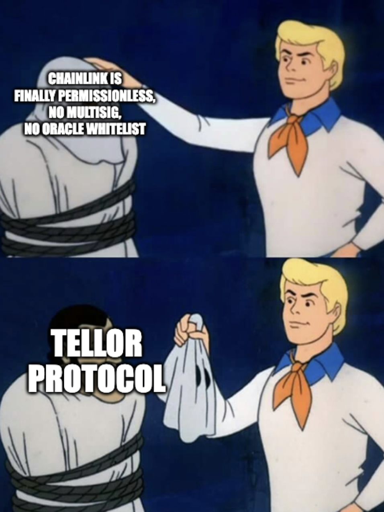

# Chainlink Style Price Feed Using Tellor

## Pre-requisites
[foundry](https://github.com/foundry-rs/foundry)

## Run tests
```
forge test
```

## How to use

<b>The Tellor oracle</b> is a decentralized oracle. It provides an option for contracts to interact securely with and obtain data from off-chain.  This repo is a sample contract that uses tellor through the Chainlink AggregatorV3 Interface.  Although tellor can be used right out of the box like this, depending on your security needs, you will need to add additional checks to ensure safety for your application.  Unlike centralized oracles like Chainlink, Tellor reporters can actually be disputed.  Like an L1 chain, values are not final, and instead can revert if they are wrong.  You should use the values optimistically and watch out for other attacks that can happen. 

 A user checklist on proper implementation can be found here:[https://docs.tellor.io/tellor/getting-data/user-checklists](https://docs.tellor.io/tellor/getting-data/user-checklists)


For more in-depth information about Tellor, check out our [documentation](https://docs.tellor.io/tellor/).


#### Maintainers <a name="maintainers"> </a>
[@themandalore](https://github.com/themandalore)
<br>
[@brendaloya](https://github.com/brendaloya)


#### How to Contribute<a name="how2contribute"> </a>  
Join our Discord:
[](https://discord.gg/teAMSZAfJZ)

Check out our issues log here on Github or contribute to our future plans to build a better miner and more examples of data secured by Tellor.


#### Contributors<a name="contributors"> </a>

This repository is maintained by the Tellor team - [www.tellor.io](https://www.tellor.io)


#### Copyright

Tellor Inc. 2024
